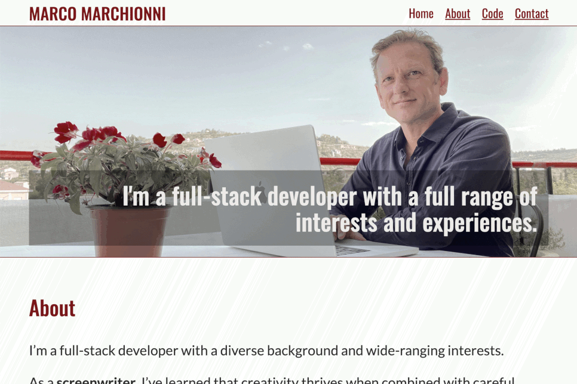

# Personal Portfolio

This repository contains the source code for my personal portfolio website. The site showcases my web development skills and projects, and includes ways to get in touch with me.

## Technologies Used

- HTML5
- CSS3 (with SASS preprocessor)
- JavaScript (ES6+)

## Features

- Responsive design that works on a variety of devices
- Smooth scrolling navigation
- Mobile navigation menu
- Active menu highlighting

## License

This project is licensed under the MIT License - see the [LICENSE.md](LICENSE.md) file for details
